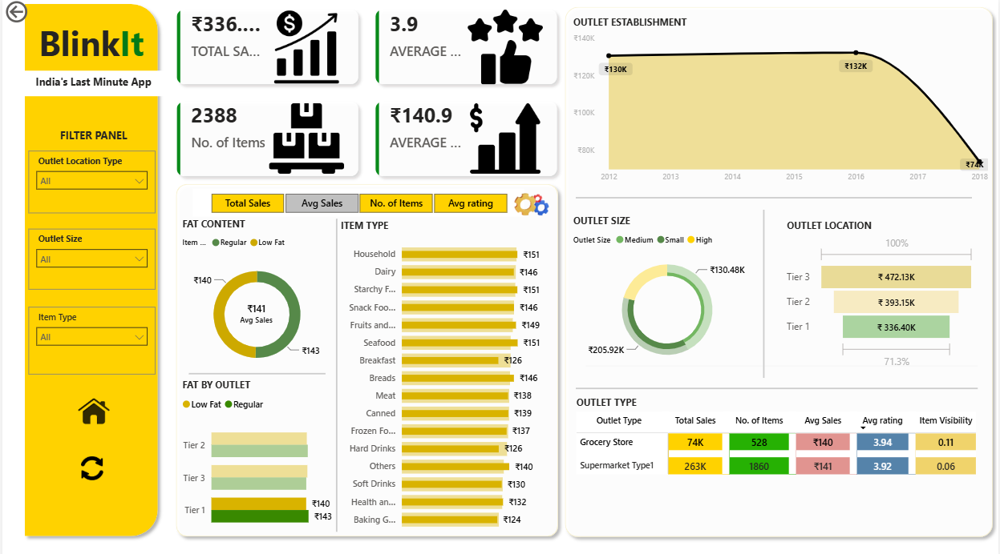

# Blinkit Sales Analytics Dashboard

## Dashboard Preview

### Main Dashboard

### Filtered Dashboard

---

## Project Overview

Developed an interactive Power BI dashboard to analyze Blinkit's retail performance across sales, outlet characteristics, customer ratings, and product categories. The dashboard enables dynamic exploration of KPIs through interactive filters and business-focused visualizations.

---

## Business Objective

To provide stakeholders with an interactive dashboard for monitoring sales performance, comparing outlet characteristics, identifying high-performing product categories, and supporting data-driven decision-making.

---

## Tools & Technologies

- Power BI
- DAX
- Power Query
- Microsoft Excel

---

## Key Features

- Interactive slicers for Outlet Size, Location, and Item Type
- KPI cards for Total Sales, Average Sales, Average Rating, and Item Count
- Outlet establishment trend analysis
- Product category performance analysis
- Outlet size and location comparison
- Fat content distribution
- Dynamic filtering and drill-down analysis

---

## Key KPIs

| KPI | Value |
|------|-------|
| Total Sales | ₹507K |
| Average Sales | ₹140 |
| Average Rating | 3.9 |
| Total Items | 3,631 |

---

## Skills Demonstrated

- Business Intelligence
- Dashboard Development
- Data Cleaning
- Data Modeling
- DAX
- Power Query
- KPI Reporting
- Data Visualization

---

## Repository Contents

- Blinkit_Analytics_Dashboard.pbix
- BlinkIt Grocery Data.xlsx
