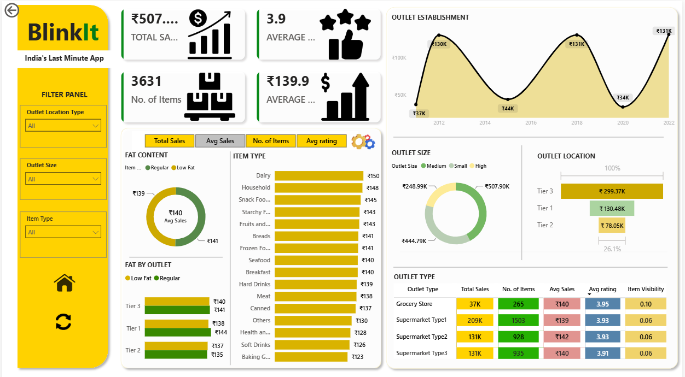

<div align="center">

# Blinkit Sales Analytics Dashboard

### End-to-End Retail Business Intelligence Solution using Power BI

Transforming retail transaction data into actionable business insights through interactive dashboards and executive reporting.

</div>

---

# Dashboard Preview

## Main Dashboard



## Filtered Dashboard


---

# Executive Summary

This project presents an end-to-end Business Intelligence solution developed in Power BI to analyze Blinkit's retail performance across sales, outlet characteristics, product categories, and customer ratings.

The dashboard consolidates operational data into interactive visualizations, enabling stakeholders to monitor key business metrics, evaluate outlet performance, identify sales trends, and support data-driven decision-making.

---

# Business Problem

Retail businesses generate large volumes of transactional data across multiple outlets and product categories. Traditional spreadsheet-based reporting limits the ability to monitor performance efficiently and identify meaningful trends.

This dashboard addresses that challenge by providing a centralized, interactive reporting solution that enables business users to analyze operational performance from multiple perspectives.

---

# Business Objectives

- Monitor overall sales performance
- Compare outlet performance across size, location, and establishment year
- Evaluate product category performance
- Analyze customer ratings
- Track key business KPIs
- Enable interactive business exploration through dynamic filtering

---

# Dashboard Features

- Interactive slicers for Outlet Size, Outlet Location, and Item Type
- KPI cards for Total Sales, Average Sales, Average Rating, and Item Count
- Outlet establishment trend analysis
- Product category performance comparison
- Outlet size distribution
- Outlet type comparison
- Fat content analysis
- Interactive cross-filtering across visuals

---

# Key Performance Indicators

| KPI | Value |
|------|-------|
| Total Sales | ₹507K |
| Average Sales | ₹140 |
| Average Rating | 3.9 |
| Total Items | 3,631 |

---

# Key Business Insights

- Medium-sized outlets generated the highest overall sales contribution.
- Grocery Stores consistently outperformed other outlet formats in total sales.
- Dairy and Household categories recorded the highest average sales per item.
- Customer ratings remained consistently around 3.9 across product categories.
- Outlet establishments peaked around 2012 before gradually declining in subsequent years.
- Interactive filtering enables rapid comparison across outlet size, location, and product categories.

---

# Technical Implementation

### Data Preparation

- Data cleaning
- Data transformation using Power Query
- Data validation

### Data Modeling

- Relationship modeling
- DAX measures
- Calculated fields

### Dashboard Development

- KPI reporting
- Interactive visualizations
- Cross-filtering
- Business dashboard design

---

# Technology Stack

| Category | Tools |
|-----------|-------|
| Business Intelligence | Power BI |
| Data Transformation | Power Query |
| Analytical Language | DAX |
| Data Source | Microsoft Excel |

---

# Skills Demonstrated

- Business Intelligence
- Dashboard Development
- Business Analytics
- Data Visualization
- Data Modeling
- KPI Reporting
- DAX
- Power Query
- Executive Reporting

---

# Repository Structure

```
Blinkit-PowerBI-Dashboard
│
├── Blinkit_Analytics_Dashboard.pbix
├── BlinkIt_Grocery_Data.xlsx
├── dashboard.png
├── filtered_dashboard.png
└── README.md
```

---

# Repository Contents

| File | Description |
|------|-------------|
| Blinkit_Analytics_Dashboard.pbix | Power BI dashboard |
| BlinkIt_Grocery_Data.xlsx | Source dataset |
| dashboard.png | Dashboard overview |
| filtered_dashboard.png | Dashboard with filters applied |

---

# About the Project

This project demonstrates the complete Business Intelligence workflow—from data preparation and transformation to dashboard development and business insight generation. It highlights the application of Power BI to convert operational retail data into actionable insights for business stakeholders.

---
